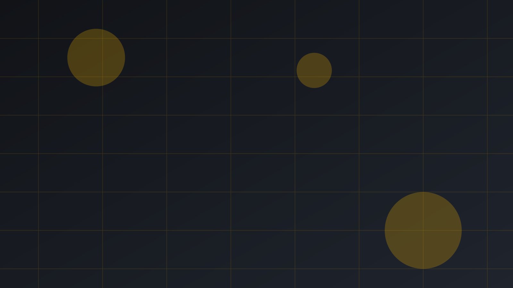

# AI Cybersecurity Assistant

AI-powered cybersecurity web platform for practical analysis, defensive guidance, and security reporting.

A beginner-friendly Flask application that combines cybersecurity utilities, guided chatbot support, and visual dashboards in one secure web interface.

[](https://github.com/Al-Momna-Umar-Daraz/AI-Cybersecurity-Assistant/actions/workflows/ci.yml)

## Modules

- Command Analyzer
- Password Checker
- URL Scanner
- Email Breach Checker (HIBP redirect workflow)
- Port Scanner
- Network Scan AI Malware Detection
- Encryption Tools
- Linux Command Safety Lab
- Face Intelligence
- AI Assistant
- Analysis Dashboard
- Reports
- Monetization
- Settings & Profile

## Tech Stack

- Python + Flask
- SQLite
- HTML/CSS/JavaScript
- Gunicorn
- PWA (service worker + manifest)

## Screenshots

Add your real screenshots inside `docs/screenshots/` and update this section before university submission.

Current theme preview:



Suggested screenshot files to add:

- `docs/screenshots/home.png`
- `docs/screenshots/network-scan.png`
- `docs/screenshots/port-scan.png`
- `docs/screenshots/analysis.png`

## Local Run

```bash
pip install -r requirements.txt
python app.py
```

Open:

- `http://127.0.0.1:5000`

## One-Click Deployment

Render:

[](https://render.com/deploy?repo=https://github.com/Al-Momna-Umar-Daraz/AI-Cybersecurity-Assistant)

Railway:

- Create new project from GitHub repo: `Al-Momna-Umar-Daraz/AI-Cybersecurity-Assistant`
- `railway.toml` and `Procfile` are included for startup config

## Environment Variables

Copy `.env.example` to `.env` and set values.

Required:

- `FLASK_SECRET_KEY`
- `OPENAI_API_KEY`

Optional:

- `HIBP_API_KEY`
- `FACECHECK_API_TOKEN`
- `GOOGLE_CLIENT_ID`
- `GOOGLE_CLIENT_SECRET`
- `STRIPE_SECRET_KEY`
- `STRIPE_PUBLISHABLE_KEY`
- `ADSENSE_CLIENT`

## CI (Auto Update Checks)

GitHub Actions workflow:

- `.github/workflows/ci.yml`

It runs on every push and pull request to `main`.

## Deployment Docs

- `deploy/DEPLOYMENT.md`
- `deploy/launch-checklist.md`
- `deploy/.env.production.template`

## Author

Developed by **Al Momna Umar Daraz**
